# AWS Secrets Manager Rotation Lambda Functions with Amazon MSK SASL/SCRAM authentication 

## Prerequisite
1. `Key Management Service (KMS)` type `Customer managed keys`
2. `AWS Secrets Manager` name start with `AmazonMSK_` which 
    
    2.1 Type is `Other type of secret`, Secret value is in this format `{"username": "nancy", "password": "WeQYaByENm"}`

    2.2 Use KMS encrytion key from 1
3. `Amazon MSK` associated with `Secret Manager` from 2
4. Client that can produce and consume message for testing and using user from 2.1

---
## Instruction

### 1. Create Lambda function

Source code that provide on this topic bases on [this template](https://github.com/aws-samples/aws-secrets-manager-rotation-lambdas/blob/b45024dcf0c529ab2374dc37a0d98f895f79da67/SecretsManagerRotationTemplate/lambda_function.py)

#### 1.1 Runtime and Architecture

- Runtime: `Python 3.9`

- Architecture: `x86_64`

then create Lambda function

#### 1.2 Zip project file

Compress project. code is in `sourcecode`

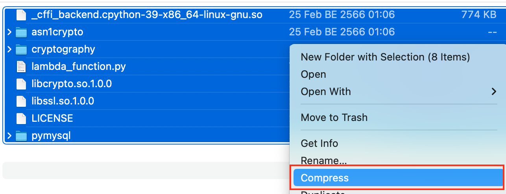

Upload to Lambda

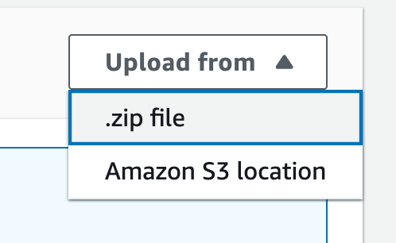

#### 1.3 Lambda Role

For `Configurations` and `Permission`, select `Lambda execution role`

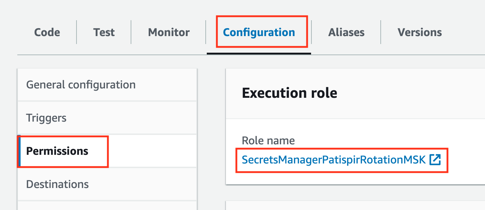

Web console will navigate to policies list of this role

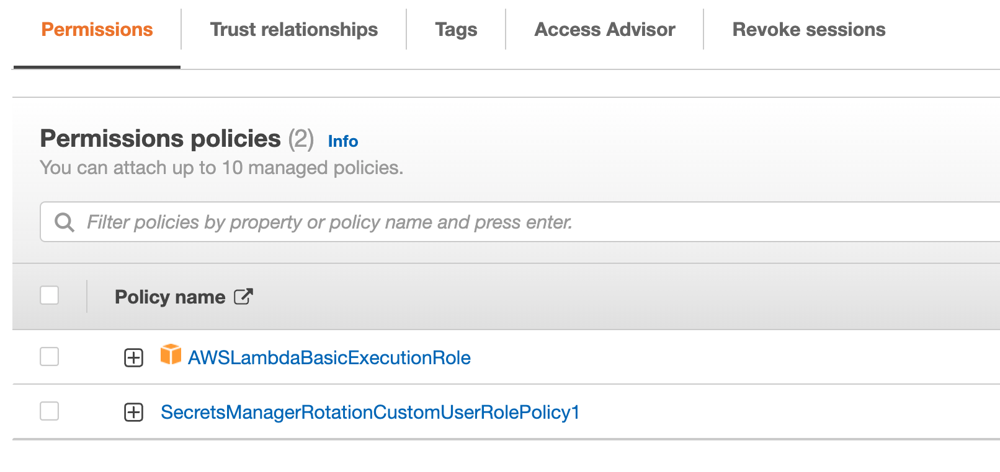

`AWSLambdaBasicExecutionRole` is `AMS Managed` role

Create Policies: `SecretsManagerRotationCustomUserRolePolicy1` by `Add Permission` and `Create inline policy`

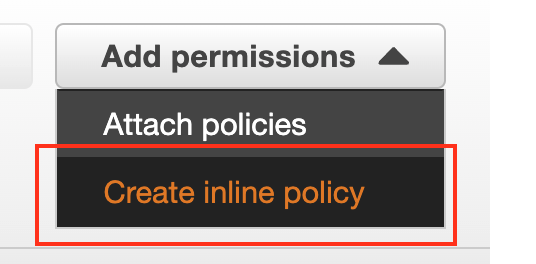

Input following JSON inline policies

```json
{
    "Version": "2012-10-17",
    "Statement": [
        {
            "Condition": {
                "StringEquals": {
                    "secretsmanager:resource/AllowRotationLambdaArn": "arn:aws:lambda:<Region>:<AccountID>:function:<FunctionName>"
                }
            },
            "Action": [
                "secretsmanager:DescribeSecret",
                "secretsmanager:GetSecretValue",
                "secretsmanager:PutSecretValue",
                "secretsmanager:UpdateSecretVersionStage"
            ],
            "Resource": "arn:aws:secretsmanager:<Region>:<AccountID>:secret:*",
            "Effect": "Allow"
        },
        {
            "Action": [
                "secretsmanager:GetRandomPassword"
            ],
            "Resource": "*",
            "Effect": "Allow"
        }
    ]
}
```

Back to Lammbda `Configurations` and `Permission`

Create new `Resource-based policy statements` and input value as following 

- Service: `Secret Manager`

- Statement ID: `Can be anything`

- Principal: `secretsmanager.amazonaws.com`

- Action: `lambda:InvokeFuntion`

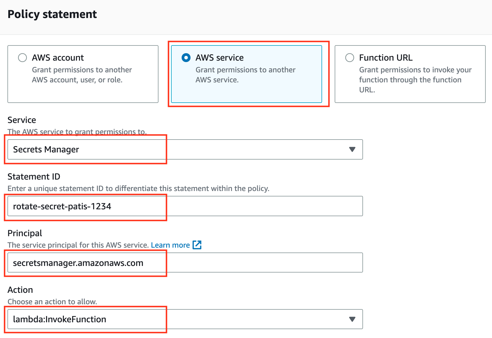

---

### 2. Add key user to `KMS`

Navigate to `Key Management Service (KMS)` type `Customer managed keys`


Add `Lambda execution role` to `Key users`

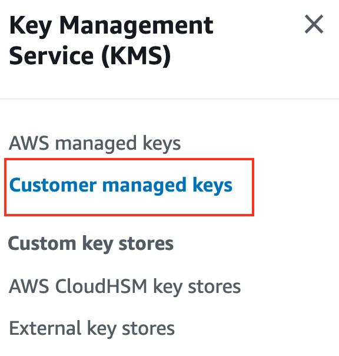

---

### 3. Enable Key Rotate on `AWS Secret manager`

Choose Lambda function that we created

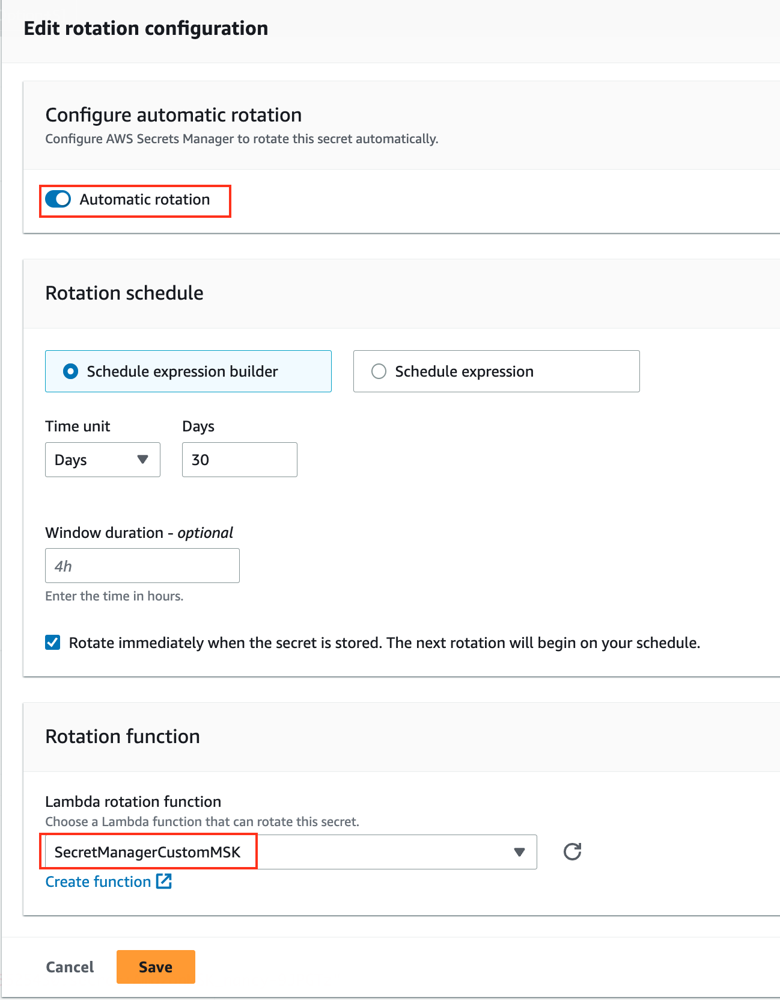
 
if `Rotate immediately when the secret is stored. The next rotation will begin on your schedule.` has checked then save. Rotation process will immediately trigger. In this case, lambda function will invoke. You can see pop up on the top of the screen.


---

### 4. Check result via `CloudWatch` 

Go to `CloudWatch`, on `Log groups` then select lambda function (start by `/aws/lambda/<Lambda function name>`)

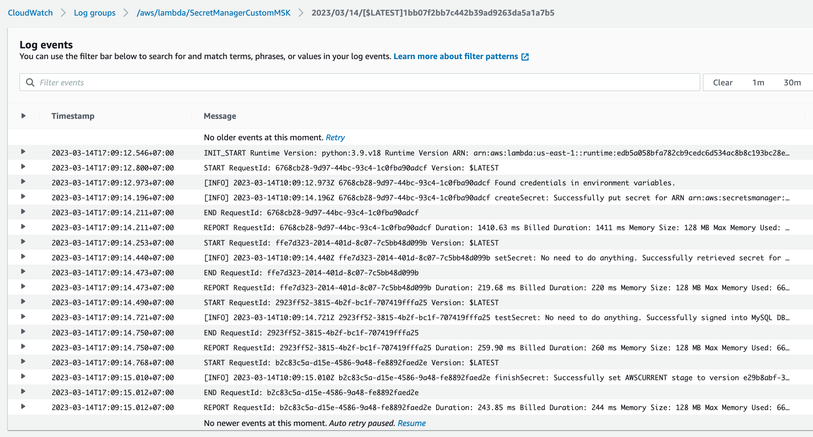

---

### 5. Update client application

Get new password from secret manager

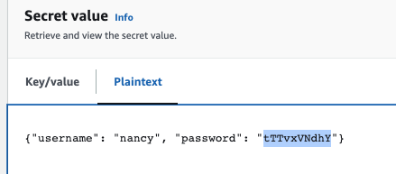

This example use cli to test message and use client properties to config connection

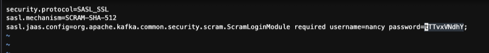

Producer can produce message with user `nancy`

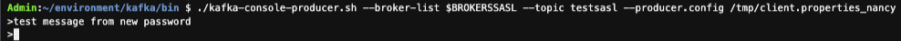

Consumer can consume message with user `nancy`

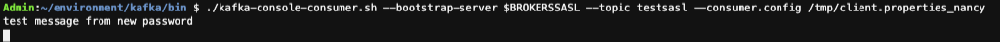
